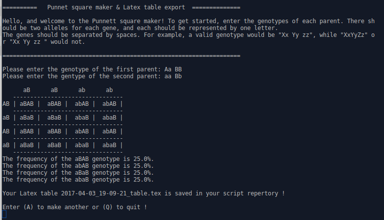
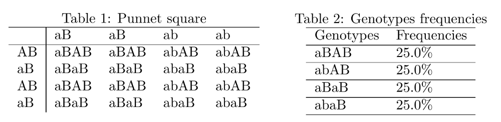

# Punnet Square Maker

A Python2 / Python3 program which creates Punnett squares and calculates potential offspring genotype frequencies.

[About the Punnet square on Wikipedia.](https://en.wikipedia.org/wiki/Punnett_square)

To use, enter genotypes of the parents when prompted. There should be **two alleles per gene** (each represented by a single character), and **genes should be separated by spaces**.

For example, "Xx Yy ZZ" and "XX YY zz" are valid input strings, while "XxYyZZ" or ""Xx Yy ZZ " *(notice the space at the end...)* is not. 

The program will then print a formatted Punnett square, and list the genotype frequencies for each distinct resulting genotype.

# Latex features
This script generates two Latex tables, the Punnet square and the frequencies table. 

